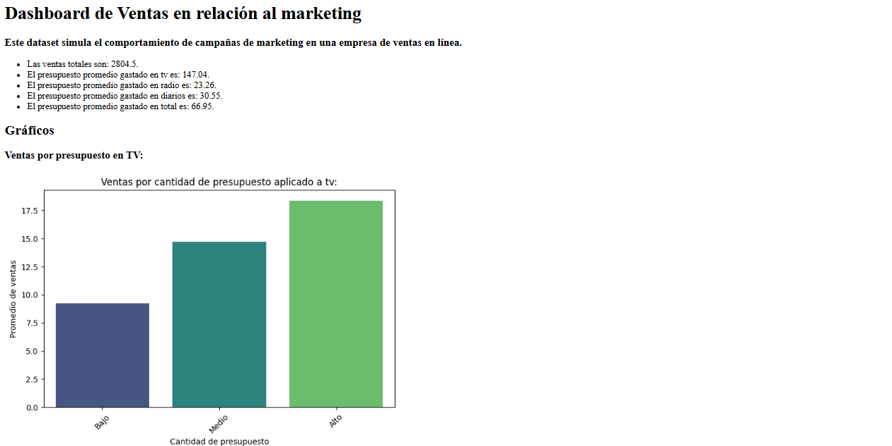

# 📊 Análisis de Ventas y Publicidad en Medios

Este proyecto analiza cómo impacta la inversión publicitaria en TV, radio y diarios sobre las ventas de una empresa, utilizando Python y visualización de datos. Se parte de un dataset simulado para explorar correlaciones, tendencias y patrones de éxito en campañas.

---

## 🎯 Objetivo

Explorar la relación entre inversión en publicidad y ventas mediante:

- Limpieza y análisis exploratorio de datos (EDA)
- Segmentación por tipo de medio (TV, radio, diarios)
- Visualización de relaciones clave
- Generación de dashboard HTML con resultados automáticos

---

## 🛠 Tecnologías utilizadas

- Python 3
- Pandas
- Seaborn
- Matplotlib

---

## 📁 Archivos incluidos

| Archivo                            | Descripción |
|-----------------------------------|-------------|
| `dashboard_ventas.py`             | Script principal que procesa los datos y genera los gráficos |
| `Advertising Budget and Sales.csv`| Dataset con presupuesto e ingresos simulados |
| `dashboard.html`                  | Dashboard HTML generado con visualizaciones y conclusiones |

---

## ▶️ Cómo ejecutarlo

1. Cloná este repositorio o descargá los archivos.
2. Ejecutá `dashboard_ventas.py` desde tu entorno Python.
3. Se generará automáticamente un archivo `dashboard.html` con el análisis completo.

> 💡 Tip: También podés optar por guardar los gráficos como imágenes en disco.

---

## 📈 Resultado

El análisis genera un dashboard en HTML que incluye:

- Gráficos de barras, dispersión y correlación
- Segmentación por tipo de inversión publicitaria
- Porcentaje de campañas exitosas según presupuesto
- Conclusiones automáticas generadas a partir del análisis

---

## 🧠 Aprendizajes

Este proyecto fue parte de mi proceso de formación práctica en análisis de datos. Me permitió consolidar habilidades clave como:

- Manipulación de datos con Pandas
- Visualización efectiva con Matplotlib y Seaborn
- Generación automática de reportes en HTML
- Comunicación de insights de forma clara y profesional

---

📬 Contacto: [juanfrescodev](https://github.com/juanfrescodev) | juanfresco1@gmail.com
